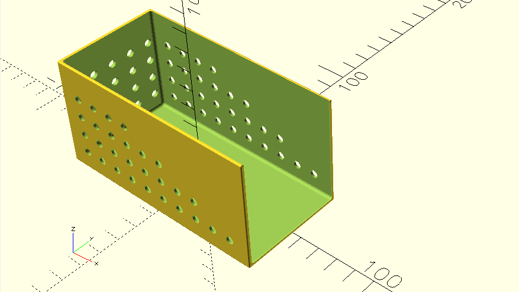
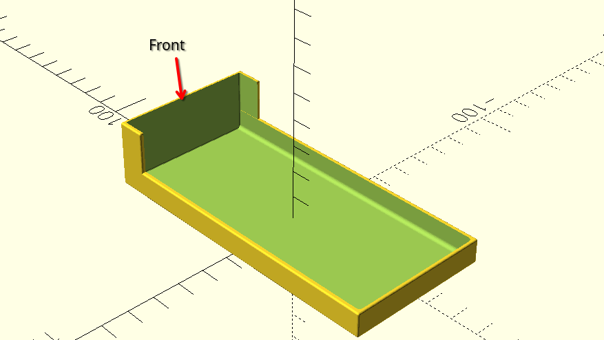

# Mouse trap boxes
openscad code for mouse trap boxes

When using mouse traps I have missed some mice because they have been able to access the trap from behind and even if the trap have triggered they have come away with the bait. I created a small box to prevent this and to force the mouse to access the bait in a optimal way for the trap.

The box also gives some protection from snow and ice if you place the trap outdoors

The box have two parts called bottom and top as shown below

The box above is created with mouse.scad. There is also a modified version that have a simple mechanism for holding or locking the top in place called mouse_w_lock.scad.

# Usage

## Prerequistes
- Actual version of [Openscad](https://openscad.org/), I use the development Snapshots
- You need to install [BOSL2](https://github.com/BelfrySCAD/BOSL2/wiki) 

## Execution
Open the file mouse.scad in Openscad and either edit directly or use the Customizer. The defaults gives a box for a standard Swedish mouse trap. 

# Stl

There is stl files for the top and bottom with and without locking mechanism in the stl directory

- [Small mouse trap top and bottom](src/mouse.scad)
- [Small mouse trap top and bottom with locking](src/mouse_w_lock.scad)
- [Mjölner mouse trap top and bottom](src/Mjölner.scad)
- [Mjölner mouse trap top and bottom with locking](src/Mjölner_w_lock.scad)

You can use the customier to set the measurerments you need.

# Printing

I have used Sunlu PETG for printing as I use my boxes outdoors. I sliced with Orcaslicer using
- Creality Generic PETG settings
- 0.3mm layer height
- Manual tree support for the locks to save material, auto support creates supports for the holes in the sides.
